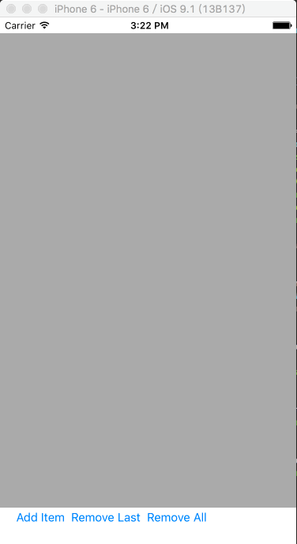

# DynamicCollectionView

A collection view which can add item、delete item dynamically.

## Characteristic

* Add Item、delete item dynamically and animatedly.
* Complete customizable cell.
* Complete customizable data structure bind to cell.

## Screenshot



## Use

1. Define data structure.

	```swift
	struct Model {
	    var text: String
	    var subtext: String
	    
	    init(text: String, subtext: String) {
	        self.text = text
	        self.subtext = subtext
	    }
	}
	```

2. Create subclass of `DynamicCollectionViewCell` and appoint the data type.
 
	```swift
	class MyCollectionViewCell: DynamicCollectionViewCell<Model> {
		...
	}
	```

3. Create `DynamicCollectionView` and register cell type

	```swift
	dynamicCollectionView = DynamicCollectionView<Model>(frame: CGRect(x: 0, y: 20, width: CGRectGetWidth(view.frame), height: 600))
	dynamicCollectionView.setBgColor(UIColor.lightGrayColor())
	dynamicCollectionView.collectionViewLayout.itemSize = CGSize(width: CGRectGetWidth(dynamicCollectionView.frame), height: 100)
	dynamicCollectionView.registerCollectionViewCellClass(MyCollectionViewCell.self)
	view.addSubview(dynamicCollectionView)
	```

4. Add or delete item.

	```swift
	let model = Model(text: "text", subtext: "\(arc4random() % 100)")
	dynamicCollectionView.addItem(model)
	```
	
	```swift
	dynamicCollectionView.removeLastItem()
	```
	
	```swift
	dynamicCollectionView.removeAllItems()
	```
